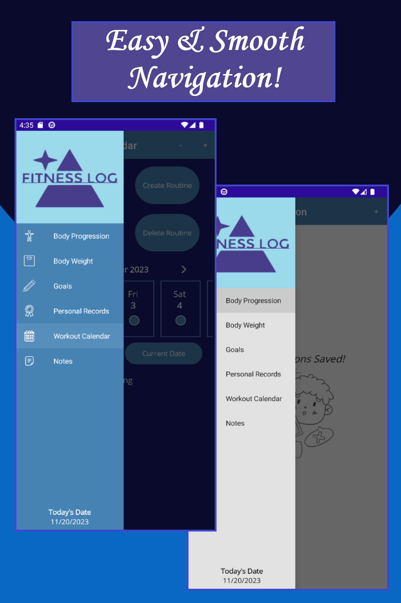
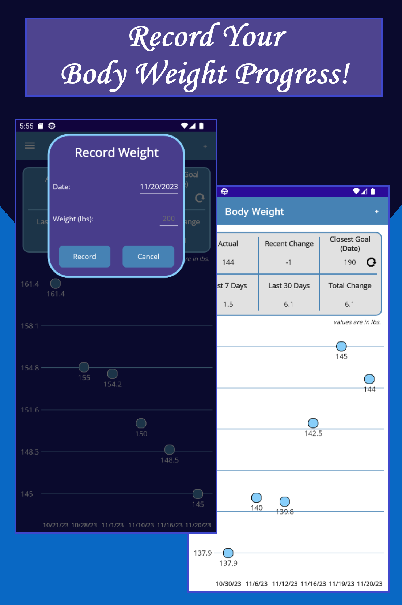
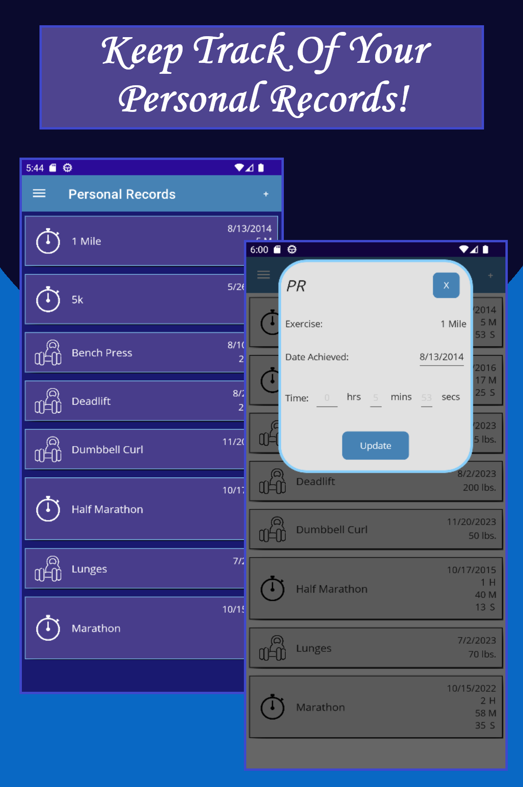
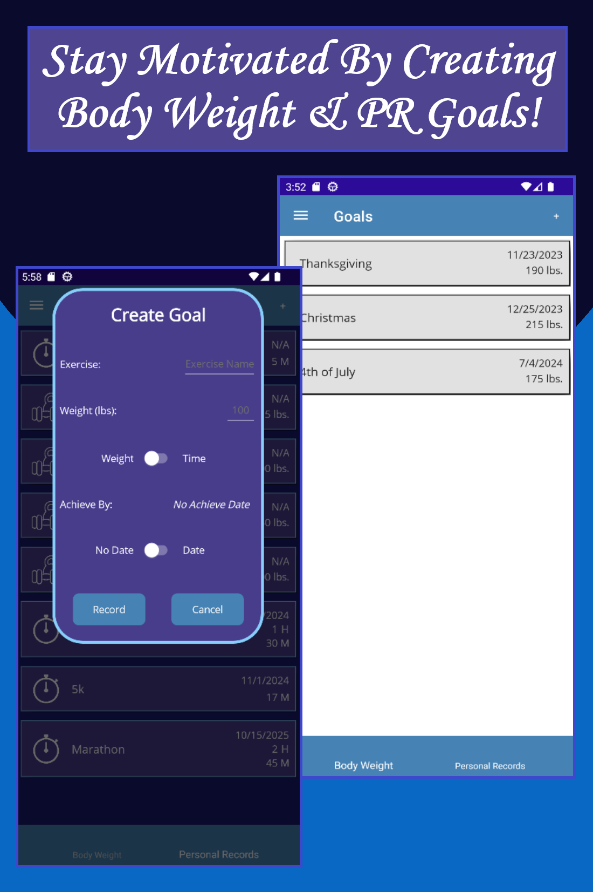
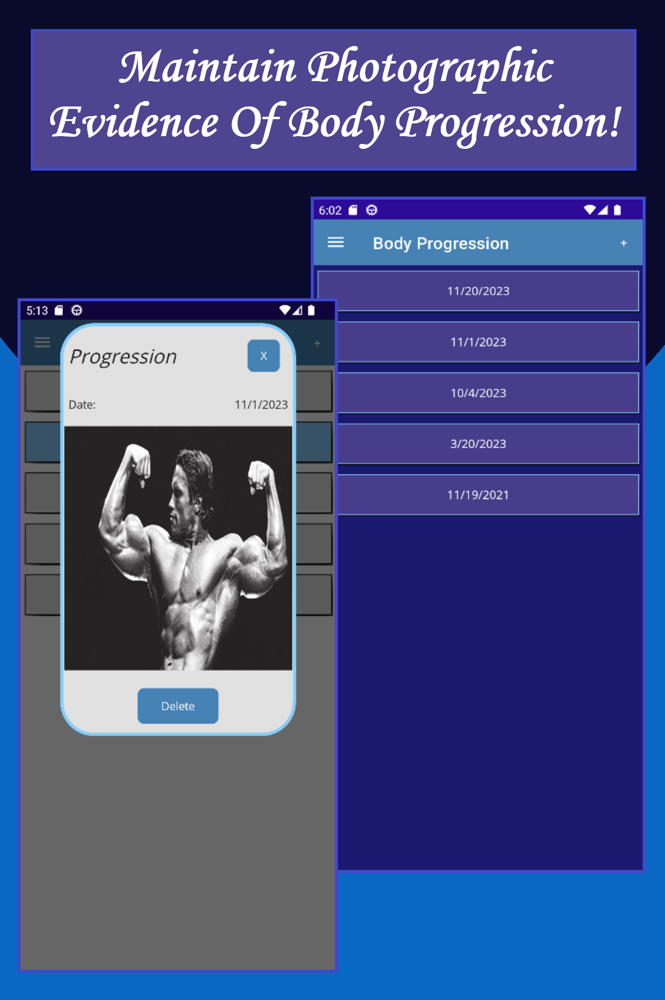
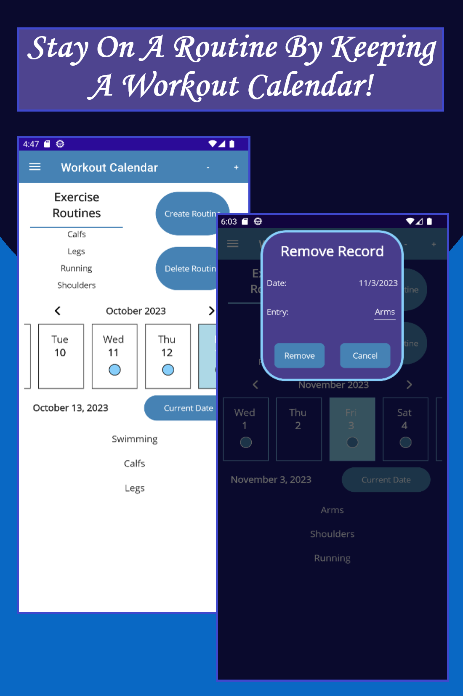

<h1 align="center" style="font-weight: bold">:running_man: Fitness Log :running_woman:</h1>

• Simply and easily record fitness information

• Keep track of your body progression and see visual results of your progress

• Quickly record your body weight and track your body weight goals along side results

• Stay motivated by creating weight lifting, timed, and body weight goals

• Remember, and view all of your personal records all in one place

• Stay on schedule with the horizontal workout calendar

<h2 align='center'>Project Screenshots</h2>

